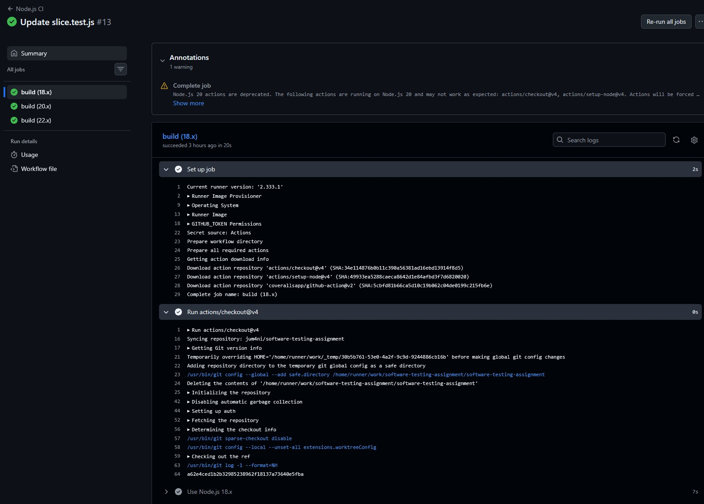
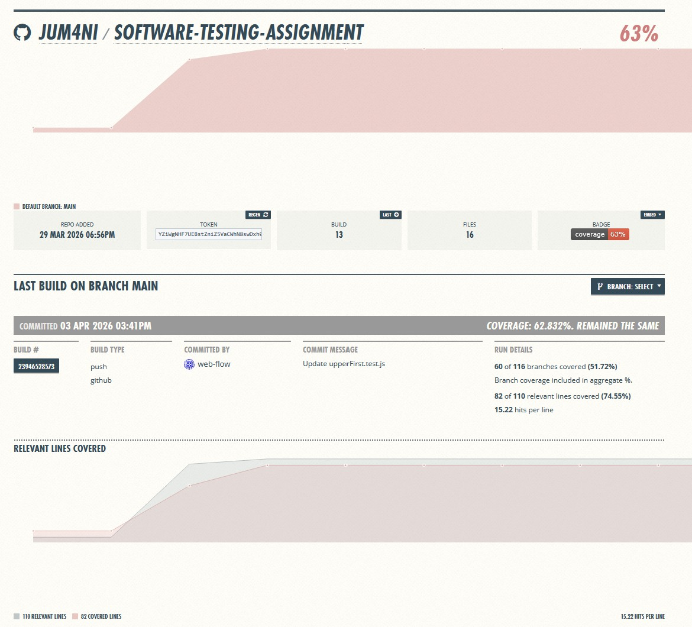
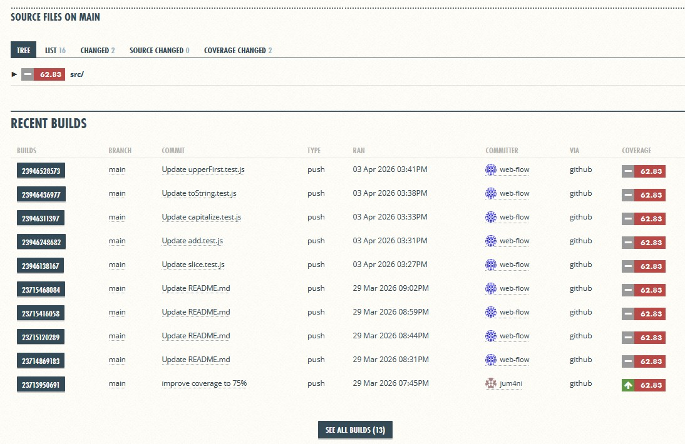

# Ohjelmistotestaus - Tehtävä

## Projektin kuvaus
Tämä projekti on osa ohjelmistojen ylläpito ja testaus kurssia. Tavoitteena oli toteuttaa testejä, integroida jatkuva integraatio (CI) sekä mitata koodin kattavuutta.
Reopositorio sisältää JavaScript-lähdekoodia sekä Jestillä toteutetut yksikkötestit.

## Testaus
Yksikkötestit on tehty projektin keskeisille funktiolle. Testit kattavat normaalitapaukset, reunatapaukset sekä tarvittaessa virhetilanteet.
Testit voidaan suorittaa komennolla:

npm test

Kaikki testit menivät läpi onnistuneesti

## Toteutustapa
Työ aloitettiin toteuttamalla ja testaamalla yksikkötestit paikallisesti Jestillä. Tämän jälkeen projektiin lisättiin GitHub Actions-workflow. joka suorittaa testit automaattisesti jokaisen pushin yhteydessä. lopuksi kattavuusraportointi yhdistettiin Coveralls-palveluun.

## Jatkuva integraatio (CI)
Github Actionsia käytetään testien automaattiseen ajamiseen jokaisen pushin yhteydessä.
Workflow (pipiline):
  - Asentaa riippuvuudet
  - Suorittaa testit
  - Luo kattavuusraportin

## Koodinkattavuus
Koodinkattavuutta mitataan Jestillä ja raportoidaan Coveralls-palveluun
  - Paikallinen kattavuus: ~75%
  - Coveralls-kattavuus: ~63%

## Havaitut ongelmat
Testauksen aikana ei havaittu kriittisiä  virheitä kirjaston toiminnassa. Kaikki testatut funktiot toimivat odotetusti.
  - Sisäisten funktioiden testikattavuus voisi olla parempi
  - Joissakin tapauksissa dokumentaatio voisi olla selkeämpi

## Yhteenveto
Projektissa toteutettiin toimiva testaus- ja integraatioprosessi. GitHub Actions huolehtii testien ajamisesta jokaisen koodimuutoksen yhteydessä, ja koodikattavuus raportoidaan automaattisesti Coverals-palveluun. Näin testaus ja laadun seuranta tapahtuvat ilman manuaalisia toimenpiteitä.
Kirjasto on testattujen ominaisuuksien perusteella toimiva ja käyttökelpoinen peruskäyttöön.

