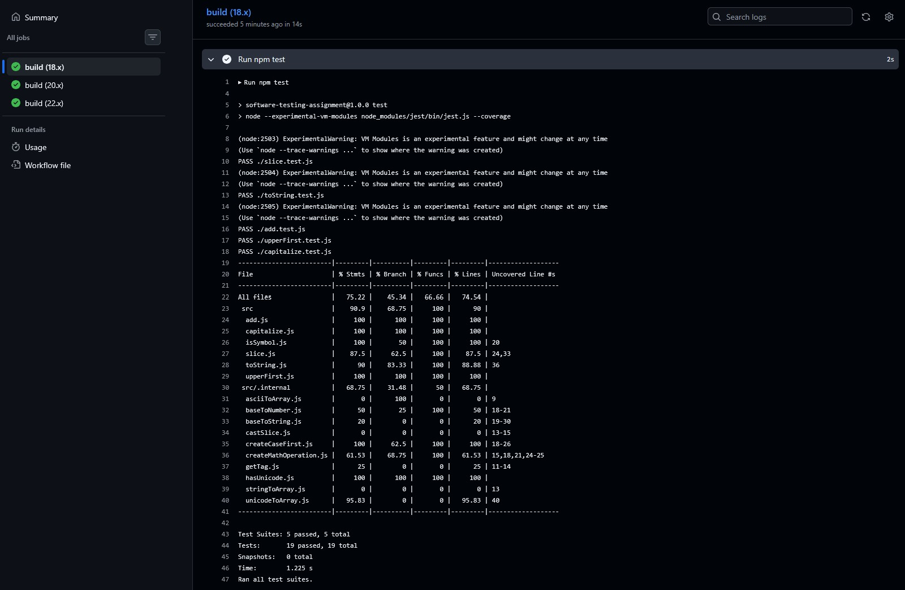
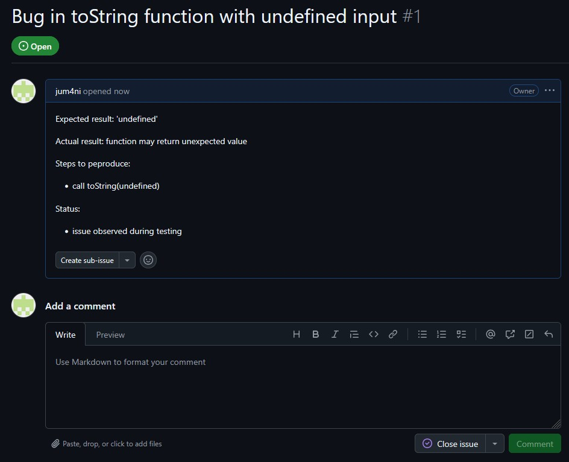

# Ohjelmistotestaus - Tehtävä

## Projektin kuvaus
Tämä projekti on osa ohjelmistojen ylläpito ja testaus kurssia. Tavoitteena oli toteuttaa testejä, integroida jatkuva integraatio (CI) sekä mitata koodin kattavuutta.
Reopositorio sisältää JavaScript-lähdekoodia sekä Jestillä toteutetut yksikkötestit.

## Testaus
Yksikkötestit on tehty projektin keskeisille funktiolle. Testit kattavat normaalitapaukset, reunatapaukset sekä tarvittaessa virhetilanteet.
Testit voidaan suorittaa komennolla:

npm test

Kaikki testit menivät läpi onnistuneesti

## Toteutustapa
Työ aloitettiin toteuttamalla ja testaamalla yksikkötestit paikallisesti Jestillä. Tämän jälkeen projektiin lisättiin GitHub Actions-workflow. joka suorittaa testit automaattisesti jokaisen pushin yhteydessä. lopuksi kattavuusraportointi yhdistettiin Coveralls-palveluun.

## Jatkuva integraatio (CI)
Github Actionsia käytetään testien automaattiseen ajamiseen jokaisen pushin yhteydessä.

Projektissa käytetään GitHub Actionsia testauksen automatisointiin.
Workflow on määritelty YAML-tiedostossa `.github/workflows/node.js.yml`.
Pipeline käyttää Github tarjoamaa runneria, joka on virtuaalinen ympäristö, jossa testit suoritetaan.

Pipeline tekee seuraavat vaiheet:
  - asentaa Node.js-ympäristön
  - asentaa projektin riippuvuudet
  - suorittaa yksikkötestit
  - luo koodikattavuusraportin

## Koodinkattavuus
Koodinkattavuutta mitataan Jestillä ja raportoidaan Coveralls-palveluun
  - Paikallinen kattavuus: ~75%
  - Coveralls-kattavuus: ~63%

## Testitulokset
Alla näkyy yksikkötestien suoritus. Kaikki testit menivät läpi onnistuneesti:

## Havaitut ongelmat
Testauksen aikana ei havaittu kriittisiä  virheitä kirjaston toiminnassa. Kaikki testatut funktiot toimivat odotetusti.
  - Sisäisten funktioiden testikattavuus voisi olla parempi
  - Joissakin tapauksissa dokumentaatio voisi olla selkeämpi

## Issue-raportti
Prjektin testauksen aikana havaittiin mahdollinen poikkeava toiminta yhdessä funktiossa. Alla on esimerkki issue-raportista GitHubissa:

## Yhteenveto
Projektin testauksen perusteella kirjasto toimii pääosin odotetusti. Kaikki toteutetut yksikkötestit menevät läpi onnistuneesti, mikä viittaa siihen, että testatut toiminnot toimivat oikein.
Koodikattavuus on noin 63%, mikä antaa kohtalaisen hyvän yleiskuvan koodin toimivuudesta, mutta ei kata kaikkia mahdollisia tilanteita. Tämän vuoksi kattavuuteen voidaan luottaa perustoiminnallisuuksien osalta, mutta kaikkia reunatapauksia ei ole välttämättä testattu.
Testauksen aikana ei havaittu merkittäviä virheitä. Kaikki Testit menivät läpi, joten kirjaston voidaan olettaa toimivan oikein testatuissa tilanteissa. Mahdolliset pienet puutteet eivät vaikuta merkittävästi käyttöön, mutta kattavuutta voisi vielä parantaa.

